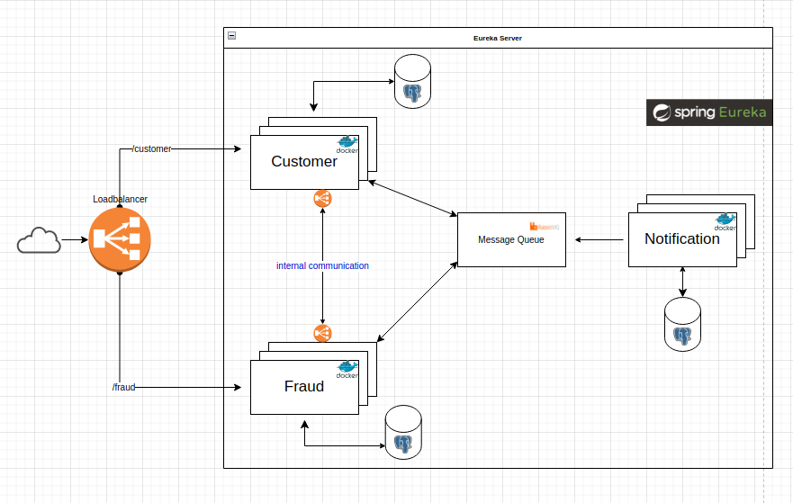

# Micro-services
Small Spring Boot project to learn and implement [RabbitMQ](https://www.rabbitmq.com) and [Spring-Cloud](https://spring.io/projects/spring-cloud) on microservices architecture

## How it works
This project has 3 microservices, each one as an independent module
* `Costumer` - Microservice application which creates a new customer
* `Fraud` - Microservice which returns if the costumer is fraudulent (Mock)
* `Notification` - Microservice to send a notification if the costumer is fraudulent or not

When you create a new Costumer, the costumerApplication request to Fraud microservice to verification 

## How to run
1. Clone this repository and open it on your favorite java IDE
2. Run maven to import all dependencies
3. Run docker-compose.yml: `docker-compose up -d` on console (It will start apigateway and eureka-server(service discovery))
4. Start first the `EurekaServerApplication` to start the service discovery and load balance
5. Start one or more Costumers and Fraud application(Eureka supports multiple instances)
   1. If you start two or more instances, certificate to alter the server.port
6. Open some REST Client like [Insomnia](https://insomnia.rest/download) and a Post to `http://localhost:8083/api/v1/customers`
   1. Body  
   { "firstName": "Example", 
      "lastName": "Example", 
      "email": "example@hotmail.com" }

## Technology Stack
This project was built using [spring.io](https://spring.io/)

* [Spring Boot](https://spring.io/guides/gs/spring-boot/)
* [PostgresSQL](https://www.postgresql.org/)
* [RabbitMQ](https://www.rabbitmq.com)
* [Eureka Server/Client](https://cloud.spring.io/spring-cloud-netflix/multi/multi_spring-cloud-eureka-server.html)
* [Docker](https://www.docker.com/)
* [Maven](https://maven.apache.org/)

## Micro-service Architecture

